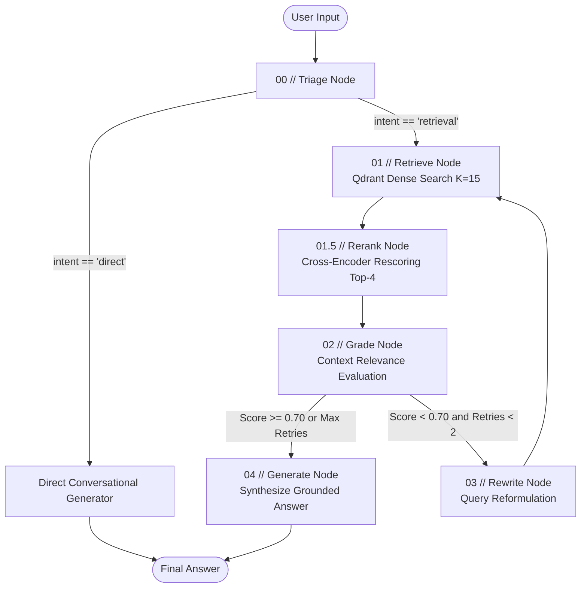
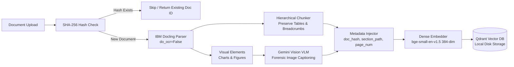

# Enterprise Document RAG Agent

A production-grade, self-correcting Retrieval-Augmented Generation (RAG) system built with **LangGraph**, **IBM Docling**, **Qdrant**, and a **Two-Stage Retrieval** pipeline (Dense Embeddings + Cross-Encoder Reranking).

Equipped with an industrial **Precision Observability Console** providing real-time telemetry, live execution tracing across state machine nodes, and cryptographic document provenance.

---

## Key Features

- **Self-Correcting Reasoning Loop (LangGraph):** State-machine driven retrieval with active relevance grading, query reformulation, and bounded retries before strict, grounded generation.
- **Intent Classification & Triage Routing:** Automatically distinguishes casual conversation from document research queries, routing greetings directly to an LLM generator while bypassing vector search.
- **Two-Stage Retrieval Architecture:** Fetches a wide candidate pool ($k=15$) via local dense embeddings (`BAAI/bge-small-en-v1.5`), then reranks down to the top-4 most relevant chunks via a local Cross-Encoder (`ms-marco-MiniLM-L-12-v2` / `BAAI/bge-reranker-base`).
- **Layout-Aware Document Parsing:** Ingests complex PDFs and Markdown using **IBM Docling** and `HierarchicalChunker`, preserving document layout hierarchy, heading breadcrumbs (`H1 > H2 > H3`), and tabular data.
- **Forensic VLM Visual Analysis:** Embedded charts, diagrams, and figures are captioned using **Google Gemini Vision** with a structured, data-extraction prompt.
- **Cryptographic Document Ledger:** Content-addressable ingestion with SHA-256 deduplication to eliminate redundant indexing.
- **Sub-Second Warm Inferences:** Zero cold-start per query via FastAPI startup `lifespan` pre-warming of model weights into RAM/CUDA VRAM.
- **Industrial Observability Console:** Zero-dependency (Vanilla HTML5/CSS/JS) high-density operations dashboard displaying real-time vector counts, latency traces, circuit state transitions, and chunk metadata.

---

## Tech Stack

| Layer | Technologies |
|---|---|
| **Core Runtime** | Python 3.12, `uv` package manager |
| **Agentic Orchestration** | LangGraph, LangChain Core |
| **Vector Storage** | Qdrant (Local disk storage with `portalocker` thread synchronization) |
| **Embeddings** | Local Hugging Face `BAAI/bge-small-en-v1.5` (384-dim, CUDA/CPU) with Gemini REST fallback |
| **Reranking** | Local Cross-Encoder / FlashRank (`ms-marco-MiniLM-L-12-v2`, `BAAI/bge-reranker-base`) |
| **LLM Inference** | Groq REST API (`qwen/qwen3.8-27b`) & Google Gemini REST API (`gemini-3.6-flash`) |
| **Document Ingestion** | IBM Docling (`HierarchicalChunker`), `pypdf`, Gemini Vision VLM |
| **API & Dashboard** | FastAPI, Uvicorn, Vanilla CSS/JS SPA |

---

## System Architecture

### 1. Agent Reasoning Loop (LangGraph State Machine)



### 2. Document Ingestion Pipeline



---

## Repository Structure

```
document-rag/
├── main.py                            # Production application launcher (Uvicorn server)
├── test_agent_graph.py                # End-to-end integration test suite
├── list_gemini_models.py              # Utility to inspect Gemini API quotas & models
├── pyproject.toml                     # uv project configuration and dependencies
├── .env.example                       # Environment variable template
├── data/                              # Working directory for raw document uploads
├── qdrant_data/                       # Local Qdrant persistent storage on disk
└── src/
    ├── config.py                      # Pydantic Settings loader with hardware thread bounds
    ├── schemas.py                     # DocumentChunk, QueryRequest, QueryResponse contracts
    ├── agent/
    │   ├── graph.py                   # LangGraph StateGraph assembly and compilation
    │   ├── llm.py                     # REST-based inference client (Groq / Gemini)
    │   ├── nodes.py                   # State machine node executors (triage, retrieve, etc.)
    │   ├── prompts.py                 # Grounding, grading, rewriting, and triage prompts
    │   ├── reranker.py                # Thread-safe Cross-Encoder reranker singleton
    │   └── state.py                   # RAGState TypedDict contract
    ├── ingestion/
    │   ├── embeddings.py              # Local Hugging Face & Gemini embedder wrappers
    │   ├── parser.py                  # IBM Docling parser & hierarchical chunk generator
    │   ├── pipeline.py                # SHA-256 ingestion orchestrator
    │   └── vision.py                  # Gemini Vision VLM figure extraction
    ├── storage/
    │   └── vector_store.py            # Thread-safe Qdrant disk storage singleton
    └── dashboard/
        ├── server.py                  # FastAPI telemetry service & execution tracer
        └── static/
            ├── index.html             # Precision Observability Console interface
            ├── style.css              # Industrial anti-purple high-density styling
            └── app.js                 # Event listeners, circuit animations, and REST polling
```

---

## Prerequisites

- **Python**: `3.12+` (bounded `< 3.13` for PyTorch CUDA compatibility)
- **Package Manager**: [uv](https://github.com/astral-sh/uv) (recommended) or standard `pip`
- **Hardware Acceleration (Optional)**: NVIDIA GPU with CUDA 12.x for accelerated local embedding and cross-encoder inference (CPU fallback supported automatically)
- **API Keys**:
  - [Groq API Key](https://console.groq.com/) (Required for sub-second primary LLM inference)
  - [Google Gemini API Key](https://aistudio.google.com/) (Optional: required for VLM diagram captioning or Gemini embeddings)

---

## Installation & Setup

### 1. Clone the Repository
```bash
git clone https://github.com/your-org/document-rag.git
cd document-rag
```

### 2. Set Up Virtual Environment & Dependencies
Using `uv`:
```bash
uv venv --python 3.12
```

Activate the virtual environment:
- **Windows (PowerShell)**:
  ```powershell
  .venv\Scripts\Activate.ps1
  ```
- **Linux / macOS**:
  ```bash
  source .venv/bin/activate
  ```

Install dependencies:
```bash
uv sync
```

> **PyTorch CUDA Note (Windows / Linux GPU):**
> If you are utilizing an NVIDIA GPU, ensure PyTorch is installed with CUDA support. `uv sync` will not overwrite existing CUDA wheels if you launch scripts using `uv run --no-sync` or activate `.venv` directly.
> To install CUDA PyTorch manually:
> ```bash
> pip install torch --index-url https://download.pytorch.org/whl/cu124
> ```

### 3. Configure Environment Variables
Copy `.env.example` to `.env`:
```bash
cp .env.example .env
```

Edit `.env` with your API credentials:
```ini
# Primary LLM Engine
LLM_PROVIDER=groq
GROQ_API_KEY=gsk_your_groq_api_key_here
GROQ_MODEL=qwen/qwen3.8-27b
GROQ_TEMPERATURE=0.3

# Google Gemini (VLM Figure Analysis & Optional Fallback)
GEMINI_API_KEY=your_gemini_api_key_here
GEMINI_MODEL=gemini-3.6-flash

# Local Dense Embeddings (Hugging Face)
EMBEDDING_PROVIDER=huggingface
LOCAL_EMBEDDING_MODEL=BAAI/bge-small-en-v1.5
EMBEDDING_DIM=384
EMBEDDING_DEVICE=cuda

# Two-Stage Reranker
USE_RERANKER=true
RERANKER_PROVIDER=flashrank
RERANKER_MODEL=ms-marco-MiniLM-L-12-v2
RERANK_CANDIDATES_K=15
RERANKER_DEVICE=cuda

# Vector DB & Storage
QDRANT_PATH=./qdrant_data
QDRANT_COLLECTION_NAME=knowledge_chunks

# RAG Reasoning Bounds
CONFIDENCE_THRESHOLD=0.70
RETRIEVAL_TOP_K=4
```

---

## Running the Application

### 1. Start the Precision Observability Console
Launch the FastAPI development server:
```bash
python main.py
```
*(Or via `uv`: `uv run --no-sync main.py`)*

The server will initialize, pre-warm embedding and reranker weights into RAM/VRAM via the FastAPI `lifespan` handler, and mount the dashboard at:
👉 **[http://127.0.0.1:8000](http://127.0.0.1:8000)**

### 2. Ingesting Documents
- **Via the Web Console**: Drag and drop any `.pdf`, `.md`, or `.txt` file into the upload zone on the dashboard. Ingestion progress, chunk count, and SHA-256 hash will be displayed in real time.
- **Via Python API**:
  ```python
  from src.ingestion.pipeline import IngestionPipeline

  pipeline = IngestionPipeline()
  result = pipeline.ingest_file("data/sample_document.pdf")
  print(f"Status: {result.status} | Chunks: {result.chunk_count}")
  ```

### 3. Querying the Agent
- **Via the Web Console**: Enter questions in the command input box. Watch the circuit flow light up dynamically as nodes execute. Click any chunk to open the metadata inspection drawer.
- **Via Python API**:
  ```python
  from src.agent.graph import run_rag_query

  response = run_rag_query("What are the key architectural layers?")
  print("Answer:", response.answer)
  print("Confidence:", response.confidence)
  for src in response.sources:
      print(f"- {src.metadata['source_file']} [p. {src.metadata['page_numbers']}]")
  ```

---

## Environment Variables Reference

| Variable | Type | Default | Description |
|---|---|---|---|
| `LLM_PROVIDER` | string | `"groq"` | Active inference engine (`"groq"` or `"gemini"`). |
| `GROQ_API_KEY` | string | `None` | Authentication key for Groq Cloud API. |
| `GROQ_MODEL` | string | `"qwen/qwen3.8-27b"` | Groq LLM model name. |
| `GROQ_TEMPERATURE` | float | `0.3` | Generation temperature for grounded synthesis. |
| `GEMINI_API_KEY` | string | `None` | Google AI Studio key for VLM figure extraction and fallback. |
| `GEMINI_MODEL` | string | `"gemini-3.6-flash"` | Gemini model used for generation and query grading. |
| `EMBEDDING_PROVIDER` | string | `"huggingface"` | Embedding backend (`"huggingface"` or `"gemini"`). |
| `LOCAL_EMBEDDING_MODEL`| string | `"BAAI/bge-small-en-v1.5"`| Hugging Face model identifier for dense embedding. |
| `EMBEDDING_DIM` | int | `384` | Dimensionality of embedding vectors (384 for bge-small). |
| `EMBEDDING_DEVICE` | string | `"cuda"` | Execution target for embeddings (`"cuda"` or `"cpu"`). |
| `USE_RERANKER` | bool | `true` | Enables/disables the second-stage Cross-Encoder reranker. |
| `RERANKER_PROVIDER` | string | `"flashrank"` | Reranker engine (`"flashrank"` or `"sentence-transformers"`). |
| `RERANKER_MODEL` | string | `"ms-marco-MiniLM-L-12-v2"`| Model identifier for cross-encoder reranking. |
| `RERANK_CANDIDATES_K` | int | `15` | Number of candidate chunks retrieved from vector store. |
| `RETRIEVAL_TOP_K` | int | `4` | Number of top reranked chunks passed to generator node. |
| `CONFIDENCE_THRESHOLD`| float | `0.70` | Minimum relevance score required to bypass query rewriter. |
| `QDRANT_PATH` | string | `"./qdrant_data"` | Local disk storage path for Qdrant database. |
| `QDRANT_COLLECTION_NAME`| string | `"knowledge_chunks"` | Qdrant collection identifier. |
| `DO_OCR` | bool | `false` | Enable/disable OCR during IBM Docling parsing. |

---

## Core Technical Deep Dive

### 1. Intent Classification & Triage
Before querying the vector database, incoming queries pass through `triage_node`:
- **Direct Queries** (e.g., *"Hello"*, *"What can you do?"*, *"Who are you?"*): Routed directly to `direct_generate_node`. Generates a conversational greeting without executing expensive embedding or vector searches.
- **Retrieval Queries** (e.g., *"What is the formula on page 4?"*): Routed to the full two-stage RAG pipeline.

### 2. Two-Stage Retrieval
Dense embedding search handles semantic recall, but cross-encoders provide superior precision:
1. **Stage 1 (Bi-Encoder Dense Search):** Qdrant performs cosine similarity across all indexed vectors, retrieving the top $k=15$ candidate chunks.
2. **Stage 2 (Cross-Encoder Reranker):** The query and candidates are jointly scored through a Cross-Encoder transformer (`(query, chunk_text)` pair). Chunks are sorted by cross-attention score, and only the top $k=4$ are supplied to the generation context.

### 3. Self-Correction & Grading
The `grade_node` scores context relevance between $0.0$ and $1.0$:
- **Pass ($\ge 0.70$):** High relevance detected. Context is forwarded to `generate_node` for grounded synthesis with citations.
- **Fail ($< 0.70$):** Low relevance detected. If `retry_count < 2`, the graph routes to `rewrite_node`, reformulating the user's question with synonyms and structural clarity, then re-retrieves.
- **Refusal Safeguard:** If relevance remains below threshold after 2 rewrites, the model issues a truthful refusal (*"I do not have sufficient information in the provided documents..."*), eliminating hallucinations.

### 4. Concurrency & Vector Store Thread Safety
On Windows and multi-worker environments, Qdrant file-based storage uses lock files (`.lock`). To prevent `portalocker.exceptions.AlreadyLocked` crashes, `src/storage/vector_store.py` implements a process-wide singleton guarded by a reentrant lock (`threading.RLock`).

### 5. Vector Dimension Auto-Realignment
If you switch embedding models (e.g., migrating between 768-dim Gemini and 384-dim BGE), `vector_store.ensure_collection()` detects the vector dimension mismatch automatically, archives the old collection, and re-initializes with the correct vector dimensions without throwing array broadcast exceptions.

---

## REST API Reference

The FastAPI telemetry service exposes the following endpoints:

| Method | Endpoint | Description |
|---|---|---|
| `GET` | `/api/stats` | Returns real-time system stats: document counts, vector count, active embedding/reranker models, and hardware execution devices. |
| `GET` | `/api/documents` | Scans the `data/` directory and returns indexing status and SHA-256 checksums for each file. |
| `POST`| `/api/upload` | Multipart file upload to `data/` with automatic immediate indexing. |
| `POST`| `/api/ingest` | Triggers indexing or re-indexing for a specific file in `data/`. Payload: `{"filename": "doc.pdf", "force_reindex": false}`. |
| `POST`| `/api/query` | Executes the LangGraph agent reasoning loop. Returns step-by-step latency traces, node execution statuses, rerank scores, and final grounded answer. Payload: `{"question": "..."}`. |

---

## Automated Testing

An end-to-end integration test suite is provided in `test_agent_graph.py`, covering:
1. **Direct Conversational Route**: Validates triage routing without vector searches.
2. **Grounded High-Confidence Flow**: Validates retrieval, cross-encoder scoring, and citation generation.
3. **Structured Response Formatting**: Validates `QueryResponse` Pydantic models.
4. **Self-Correction & Refusal**: Validates query rewriting and out-of-domain refusal.

Run the test suite inside your virtual environment:
```bash
python test_agent_graph.py
```

---

## Troubleshooting Guide

### 1. OpenBLAS Memory Allocation Crash on Windows
**Symptom:** `OpenBLAS : BLAS : Program is Terminated. Because you tried to allocate more memory than system limit.`
**Root Cause:** PyTorch and Docling spawn multiple worker threads initializing OpenBLAS thread pools concurrently, exceeding thread handles on Windows.
**Fix:** `src/config.py` and `main.py` explicitly set single-threaded environment variables before any C-extension libraries load:
```python
os.environ["OPENBLAS_NUM_THREADS"] = "1"
os.environ["OMP_NUM_THREADS"] = "1"
os.environ["MKL_NUM_THREADS"] = "1"
```

### 2. PyTorch Replaced with CPU-Only Wheel
**Symptom:** CUDA is available on system, but `EMBEDDING_DEVICE=cuda` falls back to CPU.
**Root Cause:** Running `uv sync` without pinned index flags may pull standard PyPI CPU wheels.
**Fix:** Always run with `uv run --no-sync main.py` or use your virtual environment's Python directly:
```bash
.venv\Scripts\python.exe main.py
```

### 3. Qdrant File Lock Contention
**Symptom:** `portalocker.exceptions.AlreadyLocked: .../qdrant_data/meta.json`
**Fix:** Ensure multiple server instances are not running simultaneously. Always obtain the vector store client via `get_vector_store()`, which enforces the reentrant singleton pattern.

---

## License

Enterprise Document RAG Agent is licensed under the [Apache-2.0 License](LICENSE).
